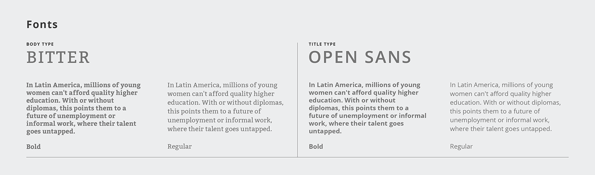

# Laboratoria Analytics

------------------------------------------------------------------------------------------------


## Introduction

------------------------------------------------------------------------------------------------

While a huge amount of new data is created on a daily basis, the necessity of organizing, filtering and manipulating this data grows exponentially at the same time. To ensure a simplified and agile way to collectively access the information, data management tools have been created to assist this task. One of them are Data Dashboards, which are particularly useful,as they display data statistics and visualization to keep track of trends or issues in real time. Data is displayed in an organized and graphic way, in order to assist in the management of information.

>[An article(2013) from Travis Pearson and Rasmus Wegener of Bain & Company](http://www.bain.com/publications/articles/big_data_the_organizational_challenge.aspx)
>based on a study performed by the same companies states:
>"Early adopters of Big Data analytics have gained a significant lead over the rest of the >corporate world. Examining more than 400 large companies, we found that those with the most >advanced analytics capabilities are outperforming competitors by wide margins (see Figure 1)."

Hence, a Data Dashboard can be understood as essential for every company, organization or start-up in need to strengthen their presence and impact on the market.

## The Users and their needs (painpoints and feelings)

------------------------------------------------------------------------------------------------

As a non-profit organization, Laboratoria focuses on training young women from low-income background as web developers(Front-end and UX Design) in the interest of promoting their forthcoming employment in the Tech World. Structured as a 6 month bootcamp, it promotes the formation of women in Lima, Arequipa, Santiago de Chile, Mexico City, Guadalajara and São Paulo.

Currently, Laboratoria is expanding and searching for new campus opportunities in all Latin America, therefore, the Training Managers from all Campuses have to be in constant communication with each other, being able to check a general database and comparing the different outcome based on the different agile methods used by each Campus. Training Managers need to access and manipulate data in a agile way and visualize it in real time.

Also, the need for managing all the data for new applicants and students grows each generation and the management of quantitative data is very important. In an attempt to help the staff to be able to monitor students advances and overview their achievements, Laboratoria is looking for a new way to manage big volumes of data and translate it into pictorial forms.

For this reason, Laboratoria Analytics was created to improve the access of Laboratoria's Training Managers to examine the individual learning progress and personalized information of each student. The platform has to be accessible, being called from either a Laptop, normal PC, Cell phone or Tablet at any time, which is why a Responsive Design is demanded.

This Data Dashboard should be able to  display visually simplified graphics and help structure, relate, filter and compare data. Another important feature should be the ability to prioritize data in different ways and communicate the results of analysis.

One of the most used tools used by the students, is Laboratoria's Learning Management System, short: LMS [What is a LMS?](https://en.wikipedia.org/wiki/Learning_management_system)

That is why it is important to supervise students advances reading time and completion in LMS, such as percentage of accomplishment sorted by lessons, etc.

## Interview

------------------------------------------------------------------------------------------------
An interview was held with one of the Training Managers of the Mexico City Campus, Lucile Baratier, in which she stated, that the staff was currently using Excel spreadsheets, making a full analysis of a students progress extremly tiresome. On occasions they would have to open too many documents in order to compare data or keep track of tendencies. This is why a data dashboard would be so useful to all the Laboratoria Staff, not only the Training Manager.

Lucile also expressed how helpful it would be to be able to compare the statistics of different campuses, so teaching strategies and other dynamics could be adjusted.


Having to count the students, oversee their assistance and general progress in different spreadsheets obstructs a more agile work pace, thus, one of the most needed features would be a table, where all the students can be displayed and filtered by generation and campus.

She also expressed the need to sort the students by name, last name, progress and activeness, as well as a detailed student profile to be able to supervise specific cases.

[SEE INTERVIEW](https://youtu.be/u2U9bEp9p74)


## The Data

------------------------------------------------------------------------------------------------
The given data includes in total three generations, the third, the fourth and the fifth of three campuses, Lima, Sangtiago and Mexico, in which we can find information about each student, such as the name, the e-mail address and their current LMS progress status.
Departing from this status, an average of each generation and campus should be calculated.

Furthermore, detailed information about reading time and completion on topics and subtopics is given for each student.

## Design, sketch and prototype

------------------------------------------------------------------------------------------------
After the interview a sketch was elaborated, based on the obtained information, like needs and painpoint, accesability and agile use.

### Colours and Typography




[Laboratoria Official Colour and Typography Guide](https://www.behance.net/gallery/62847359/Laboratoria-Re-Branding)

### Sketch


### Branding


### High Fidelity Prototype

After a fast sketch, always keeping in mind the users needs, a high fidelity prototype was designed.


## Tech/framework used

------------------------------------------------------------------------------------------------
Built with:

* HTML5
* CSS3
* Javascript
* Visual Code Studio

Other used tools:

* Figma

## Table of Contents

------------------------------------------------------------------------------------------------

```text
./
├── .editorconfig
├── .eslintrc
├── .gitignore
├── README.md
├── data
│   └── laboratoria.json
├── package.json
├── src
│   ├── css
│   │   └── style.css
│   ├── img
│   │   ├── colours.jpg
│   │   ├── figmaprototype.png
│   │   ├── Login.png
│   │   ├── logo.jfif
│   │   ├── logoLaboratoria.png
│   │   ├── logoLaboratoriasmall.png
│   │   ├── mockup1.jfif
│   │   ├── mockup2.jfif
│   │   └── typography.png
│   ├── js
│   │   ├── login.js
│   │   └── main.js
│   ├── views
│   │   └── page2.html
│   ├── data.js
│   └── index.html
└── test
    ├── data.spec.js
    ├── fixtures.js
    ├── headless.js
    └── index.html

```

## API Reference

------------------------------------------------------------------------------------------------
<https://raw.githubusercontent.com/lindatablerosgessner/cdmx-2018-06-bc-core-am-data-dashboard/master/data/laboratoria.json>

## Tests

------------------------------------------------------------------------------------------------

* Mocha
* Chai

## Build status

------------------------------------------------------------------------------------------------
Laboratoria Analytics is still under construction.

## Contribute

------------------------------------------------------------------------------------------------
Please send a pull request if you would like to contribute.
